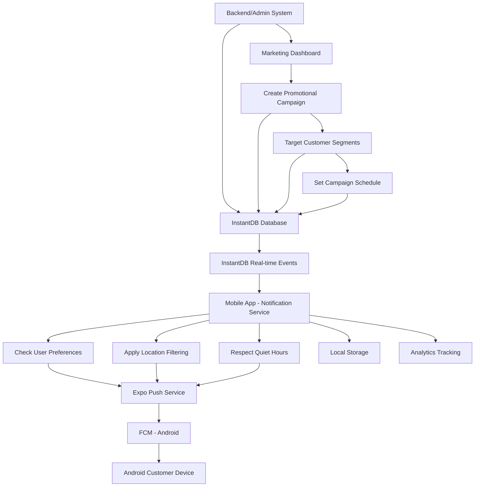

# Design Document

## Overview

The push notification system for the Silvers Android storefront application will provide a customer-facing promotional notification experience using Expo's notification services and Firebase Cloud Messaging (FCM). The system will integrate with InstantDB's real-time capabilities to deliver promotional offers, deals, and marketing campaigns specifically to Android customers. The design emphasizes Android-optimized customer engagement, promotional effectiveness, and seamless integration with the existing React Native/Expo architecture.

## Architecture

### Notification Initiation Flow

The promotional push notification system is triggered by backend marketing operations that create promotional campaigns in InstantDB. Here's how the process works:

1. **Backend Triggers**: Your backend application (admin system or marketing dashboard) creates promotional campaigns by:
   - Creating promotional campaigns in a new `promotions` table
   - Targeting specific customer segments or all customers
   - Setting campaign timing and delivery preferences

2. **InstantDB Real-time Events**: When backend systems create or update promotional campaigns in InstantDB, the database automatically emits real-time events to all connected mobile apps

3. **Mobile App Event Listeners**: The mobile app listens for promotional campaign events and triggers notifications based on:
   - User opt-in preferences for marketing notifications
   - Location filtering for location-specific promotions
   - Quiet hours settings
   - Campaign targeting criteria

4. **Push Notification Delivery**: The Android app sends promotional notifications through Expo's push service and FCM to reach targeted customers' Android devices

### High-Level Architecture



### System Components

1. **Notification Manager**: Central service managing all notification operations
2. **Permission Handler**: Manages notification permissions and user preferences
3. **Token Manager**: Handles Expo push token registration and management
4. **InstantDB Event Listeners**: Real-time event subscribers that listen for backend data changes
5. **Notification Scheduler**: Handles local and scheduled notifications
6. **Deep Link Handler**: Manages navigation from notification taps
7. **Analytics Tracker**: Tracks notification delivery and engagement
8. **Preference Manager**: Manages user notification settings

### Backend Integration Flow

```typescript
// Example backend workflow for promotional campaigns
class PromotionalService {
  async createPromotionalCampaign(campaignData: Partial<PromotionalCampaign>) {
    // 1. Backend creates promotional campaign in InstantDB
    const campaign = await db.promotions.create({
      title: campaignData.title,
      message: campaignData.message,
      imageUrl: campaignData.imageUrl,
      targetAudience: campaignData.targetAudience || 'all',
      locationIds: campaignData.locationIds,
      customerSegment: campaignData.customerSegment,
      startDate: campaignData.startDate || new Date(),
      endDate: campaignData.endDate,
      isActive: true,
      clickAction: campaignData.clickAction,
      metadata: campaignData.metadata,
      createdAt: new Date(),
      updatedAt: new Date()
    });
    
    // 2. InstantDB automatically emits real-time event
    // 3. Mobile app receives event and processes promotional notification
    // 4. Eligible customers receive push notification about the promotion
    
    return campaign;
  }
  
  async schedulePromotionalCampaign(campaignData: Partial<PromotionalCampaign>, scheduleDate: Date) {
    // Create campaign but set isActive to false initially
    const campaign = await this.createPromotionalCampaign({
      ...campaignData,
      startDate: scheduleDate,
      isActive: false
    });
    
    // Schedule activation (this could be handled by a cron job or scheduler)
    // When the scheduled time arrives, update isActive to true
    // The mobile app will then receive the real-time event and send notifications
    
    return campaign;
  }
  
  async sendTargetedOffer(userId: string, offerData: Offer) {
    // Create a personalized promotional campaign for specific user
    await db.promotions.create({
      title: offerData.title,
      message: offerData.message,
      targetAudience: 'customer_segment',
      customerSegment: userId, // Target specific user
      isActive: true,
      startDate: new Date(),
      endDate: offerData.expiryDate,
      clickAction: offerData.clickAction,
      createdAt: new Date(),
      updatedAt: new Date()
    });
  }
}
```

## Components and Interfaces

### Core Notification Service

```typescript
interface NotificationService {
  // Initialization
  initialize(): Promise<void>;
  registerForPushNotifications(): Promise<string | null>;
  
  // Permission Management
  requestPermissions(): Promise<boolean>;
  getPermissionStatus(): Promise<NotificationPermissionStatus>;
  
  // Token Management
  getExpoPushToken(): Promise<string | null>;
  refreshPushToken(): Promise<string | null>;
  
  // Event Handling
  setupEventListeners(): void;
  handleNotificationReceived(notification: Notification): void;
  handleNotificationResponse(response: NotificationResponse): void;
  
  // Notification Sending
  scheduleLocalNotification(content: NotificationContent, trigger?: NotificationTrigger): Promise<string>;
  cancelNotification(identifier: string): Promise<void>;
  cancelAllNotifications(): Promise<void>;
}
```

### Notification Types

```typescript
enum NotificationType {
  PROMOTIONAL = 'promotional'
}

interface NotificationContent {
  title: string;
  body: string;
  data?: Record<string, any>;
  sound?: string;
  badge?: number;
  categoryId?: string;
  priority?: 'default' | 'high' | 'max';
}

interface NotificationPreferences {
  promotionalOffers: boolean;
  quietHoursEnabled: boolean;
  quietHoursStart: string; // HH:MM format
  quietHoursEnd: string; // HH:MM format
  locationFiltering: boolean;
  preferredLocations: string[];
}
```

### Backend Integration Points

The notification system integrates with your backend through InstantDB's real-time capabilities. Here are the key integration points:

#### Backend Operations That Trigger Notifications

```typescript
// Backend operations that trigger promotional notifications
interface BackendTriggers {
  // Marketing & Promotions
  createPromotionalCampaign(campaign: PromotionalCampaign): Promise<void>;
  sendTargetedOffer(userId: string, offer: Offer): Promise<void>;
  schedulePromotionalCampaign(campaign: PromotionalCampaign, scheduleDate: Date): Promise<void>;
  updatePromotionalCampaign(campaignId: string, updates: Partial<PromotionalCampaign>): Promise<void>;
}

// New InstantDB schema addition for promotions
interface PromotionalCampaign {
  id: string;
  title: string;
  message: string;
  imageUrl?: string;
  targetAudience: 'all' | 'location_specific' | 'customer_segment';
  locationIds?: string[];
  customerSegment?: string;
  startDate: Date;
  endDate: Date;
  isActive: boolean;
  createdAt: Date;
  updatedAt: Date;
  clickAction?: string; // Deep link URL
  metadata?: Record<string, any>;
}
```

#### InstantDB Event Listeners (Mobile App Side)

```typescript
interface EventHandlers {
  // Listen for promotional campaigns from backend
  onPromotionalCampaign(campaign: PromotionalCampaign): void;
  onPromotionalCampaignUpdate(campaign: PromotionalCampaign): void;
}

// Example: Backend creates promotional campaign
// Backend: db.promotions.create({ title: "50% Off Sale", message: "Limited time offer!", targetAudience: "all", isActive: true })
// Mobile App: Receives real-time event and triggers promotional notification to eligible users

interface PromotionalEvent {
  campaignId: string;
  title: string;
  message: string;
  imageUrl?: string;
  targetAudience: 'all' | 'location_specific' | 'customer_segment';
  locationIds?: string[];
  customerSegment?: string;
  clickAction?: string;
  metadata?: Record<string, any>;
  isActive: boolean;
  startDate: Date;
  endDate: Date;
}
```

### Deep Link Navigation

```typescript
interface DeepLinkHandler {
  handleNotificationNavigation(data: NotificationData): void;
  navigateToPromotionalOffer(campaignId: string): void;
  navigateToProduct(productId: string): void;
  navigateToCollection(collectionId: string): void;
  navigateToCustomPage(url: string): void;
}

interface NotificationData {
  type: NotificationType;
  entityId: string;
  action?: string;
  metadata?: Record<string, any>;
}
```

## Data Models

### Notification Storage Schema

```typescript
interface StoredNotification {
  id: string;
  type: NotificationType;
  title: string;
  body: string;
  data: NotificationData;
  timestamp: Date;
  read: boolean;
  delivered: boolean;
  interacted: boolean;
}

interface NotificationQueue {
  id: string;
  notification: NotificationContent;
  scheduledFor: Date;
  retryCount: number;
  maxRetries: number;
  status: 'pending' | 'sent' | 'failed' | 'cancelled';
}

interface UserNotificationToken {
  userId: string;
  expoPushToken: string;
  deviceId: string;
  platform: 'android';
  createdAt: Date;
  lastUpdated: Date;
  isActive: boolean;
}
```

### Analytics Data Models

```typescript
interface NotificationAnalytics {
  notificationId: string;
  userId: string;
  type: NotificationType;
  sentAt: Date;
  deliveredAt?: Date;
  openedAt?: Date;
  interactedAt?: Date;
  deliveryStatus: 'sent' | 'delivered' | 'failed' | 'bounced';
  errorMessage?: string;
}

interface EngagementMetrics {
  totalSent: number;
  totalDelivered: number;
  totalOpened: number;
  totalInteracted: number;
  deliveryRate: number;
  openRate: number;
  interactionRate: number;
  byType: Record<NotificationType, EngagementMetrics>;
}
```

## Error Handling

### Error Types and Recovery Strategies

```typescript
enum NotificationError {
  PERMISSION_DENIED = 'permission_denied',
  TOKEN_REGISTRATION_FAILED = 'token_registration_failed',
  NETWORK_ERROR = 'network_error',
  INVALID_NOTIFICATION_DATA = 'invalid_notification_data',
  DELIVERY_FAILED = 'delivery_failed',
  DEVICE_NOT_SUPPORTED = 'device_not_supported'
}

interface ErrorHandler {
  handlePermissionDenied(): void;
  handleTokenRegistrationFailure(error: Error): void;
  handleNetworkError(error: Error): void;
  handleDeliveryFailure(notificationId: string, error: Error): void;
  retryFailedNotification(notificationId: string): Promise<boolean>;
}
```

### Retry Logic

- **Exponential Backoff**: Failed notifications retry with increasing delays (1s, 2s, 4s, 8s, 16s)
- **Maximum Retries**: Limit of 5 retry attempts per notification
- **Circuit Breaker**: Temporary suspension of notifications if failure rate exceeds 50%
- **Fallback Mechanisms**: Local notifications for critical updates when push fails

### Offline Handling

- **Queue Management**: Store notifications locally when device is offline
- **Sync on Reconnect**: Deliver queued notifications when connectivity is restored
- **Deduplication**: Prevent duplicate notifications during sync
- **Expiration**: Remove stale notifications older than 24 hours

## Testing Strategy

### Unit Testing

```typescript
describe('NotificationService', () => {
  test('should register for push notifications successfully');
  test('should handle permission denial gracefully');
  test('should queue notifications when offline');
  test('should retry failed notifications with exponential backoff');
  test('should respect user notification preferences');
  test('should handle deep link navigation correctly');
});

describe('EventHandlers', () => {
  test('should trigger order update notifications');
  test('should trigger inventory restock notifications');
  test('should filter notifications by user preferences');
  test('should respect quiet hours settings');
});
```

### Integration Testing

- **End-to-End Notification Flow**: Test complete notification lifecycle from trigger to delivery
- **InstantDB Integration**: Verify real-time event handling and notification triggering
- **Deep Link Navigation**: Test navigation from notifications to appropriate screens
- **Permission Handling**: Test permission request and denial scenarios
- **Offline/Online Scenarios**: Test notification queuing and sync behavior

### Device Testing

- **Physical Android Device Testing**: Push notifications require physical Android devices for testing
- **Android-Specific Testing**: Focus on Android notification behaviors, channels, and FCM integration
- **Background/Foreground Testing**: Verify notifications work in all Android app states
- **Android Permission States**: Test various Android notification permission configurations

### Performance Testing

- **Memory Usage**: Monitor memory consumption during notification processing
- **Battery Impact**: Measure battery usage of notification listeners
- **Network Usage**: Track data consumption for notification operations
- **Response Times**: Measure notification delivery and processing times

## Security Considerations

### Data Privacy

- **Token Security**: Secure storage of Expo push tokens
- **User Data Protection**: Minimal personal data in notification payloads
- **Encryption**: Encrypt sensitive notification data in local storage
- **Data Retention**: Automatic cleanup of old notification data

### Permission Management

- **Graceful Degradation**: App functionality maintained without notification permissions
- **Clear Consent**: Transparent permission requests with clear explanations
- **Opt-out Mechanisms**: Easy notification preference management
- **Compliance**: GDPR and privacy regulation compliance

### Notification Content

- **Content Validation**: Sanitize and validate all notification content
- **Deep Link Security**: Validate deep link URLs to prevent malicious navigation
- **Rate Limiting**: Prevent notification spam and abuse
- **Content Filtering**: Filter inappropriate or malicious content

## Performance Optimization

### Efficient Event Handling

- **Debouncing**: Prevent rapid-fire notifications from frequent data changes
- **Batching**: Group related notifications to reduce noise
- **Smart Filtering**: Only process events relevant to the current user
- **Memory Management**: Efficient cleanup of event listeners and handlers

### Network Optimization

- **Connection Pooling**: Reuse network connections for notification API calls
- **Compression**: Compress notification payloads where possible
- **Caching**: Cache notification templates and user preferences
- **Background Sync**: Efficient background synchronization of notification data

### Storage Optimization

- **Data Compression**: Compress stored notification data
- **Automatic Cleanup**: Regular cleanup of old notifications and analytics data
- **Efficient Queries**: Optimized database queries for notification retrieval
- **Lazy Loading**: Load notification history on demand

## Monitoring and Analytics

### Key Metrics

- **Delivery Rate**: Percentage of notifications successfully delivered
- **Open Rate**: Percentage of delivered notifications opened by users
- **Interaction Rate**: Percentage of notifications that led to app interactions
- **Error Rate**: Percentage of failed notification attempts
- **User Engagement**: Time spent in app after notification interaction

### Logging Strategy

- **Structured Logging**: Consistent log format for notification events
- **Error Tracking**: Comprehensive error logging with context
- **Performance Metrics**: Response time and resource usage logging
- **User Journey Tracking**: Track user flow from notification to app interaction

### Dashboard Requirements

- **Real-time Monitoring**: Live notification delivery status
- **Historical Analytics**: Trends and patterns in notification performance
- **User Segmentation**: Performance metrics by user segments
- **A/B Testing Support**: Framework for testing notification variations